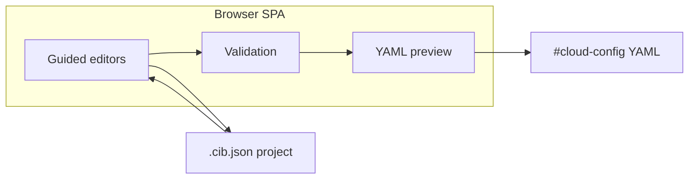

# Cloud-Init Builder

A guided visual builder for [cloud-init](https://cloud-init.io/) configuration. Built for Proxmox homelab users and sysadmins who prepare reusable server templates and usually hand-write `#cloud-config` YAML today.

**Core value:** generate correct cloud-init configuration with high confidence that the exported YAML is valid.

Cloud-Init Builder is a client-side single-page app. There is no backend, no account, and no server-side processing. You configure identity, users, and commands through guided forms, review a live YAML preview, and export artifacts for deployment or later editing.



## Features

v1 focuses on the workflows most common in homelab and template prep. The builder currently covers three sections: **Identity**, **Users**, and **Commands**.

### Identity

- Hostname, FQDN, timezone, locale, and `/etc/hosts` behavior (`manage_etc_hosts`, `prefer_fqdn_over_hostname`)
- Field validation before export
- Empty optional fields are omitted from exported YAML

### Users

- Preserve or customize the default cloud-init user
- Add, edit, and remove custom users (username, full name, groups, shell, sudo)
- Password options with validation and safety warnings
- One or more SSH authorized keys per user, with key-format validation

### Commands

- Separate **bootcmd** and **runcmd** editors with reordering
- Enter commands as shell strings or argv arrays
- UI guidance on the difference between boot-time and first-boot commands
- Safety warnings for risky command patterns

### Export and projects

- Export deployable `#cloud-config` YAML (filename uses hostname when set, otherwise the project name)
- Save and reopen builder projects as `{slug}.cib.json` (`.json` is also accepted on import)
- Copy YAML to clipboard
- Unsaved-change guards when starting a new project or opening a file

### Validation

- Inline errors and warnings in the builder
- YAML export is blocked when the configuration is invalid
- Generated YAML always starts with the required `#cloud-config` header

## Quick start

**Prerequisites:** Node.js 20 or newer

```bash
git clone <repo-url>
cd cloud-init-builder
npm install
npm run dev
```

Open the URL Vite prints (default `http://localhost:5173`).

Production build:

```bash
npm run build    # output in dist/
npm run preview  # serve dist/ locally
```

The app is static HTML, CSS, and JavaScript. Deploy `dist/` to GitHub Pages, Netlify, Vercel, or any static host.

## Typical workflow

1. Set identity fields (hostname is useful for meaningful YAML export filenames).
2. Configure users and SSH keys.
3. Add `bootcmd` / `runcmd` entries as needed.
4. Review the live preview and fix validation issues.
5. **Export YAML** for Proxmox or other cloud-init targets.
6. **Save** a `.cib.json` project file to resume editing later.

## Development

| Command | Purpose |
|---------|---------|
| `npm run dev` | Vite dev server |
| `npm run build` | Typecheck + production build |
| `npm run preview` | Preview production build |
| `npm run lint` | ESLint (`--max-warnings 0`) |
| `npm test` | Vitest unit and integration tests |

End-to-end tests use Playwright and are not wired to an npm script:

```bash
npx playwright install chromium
npx playwright test
```

Playwright builds the app and runs against the preview server (see `playwright.config.ts`).

## Project layout

| Path | Purpose |
|------|---------|
| `src/models/` | Zod schemas for project, identity, users, and commands |
| `src/generators/` | YAML generation pipeline |
| `src/validators/` | Field-level and export validation |
| `src/services/` | Project import/export and YAML download |
| `tests/fixtures/` | Golden YAML and `.cib.json` fixtures |

See [`docs/ARCHITECTURE.md`](docs/ARCHITECTURE.md) for the full architecture overview.

## Not in v1

The following are planned for later milestones, not the current release:

- Packages, networking, storage, and `write_files`
- Raw YAML as the primary authoring workflow
- Backend persistence or collaboration features
- Full cloud-init module coverage

Additional design and validation docs live in [`docs/`](docs/), including generation rules, field mapping, and validation behavior.

## Tech stack

- React 19
- TypeScript
- Vite 7
- Zustand
- Zod
- `yaml`
- Tailwind CSS 4

See [`docs/TECH-STACK.md`](docs/TECH-STACK.md) for longer-term stack direction. The README reflects dependencies in `package.json` today.

## License

Apache License 2.0. See [LICENSE](LICENSE).
